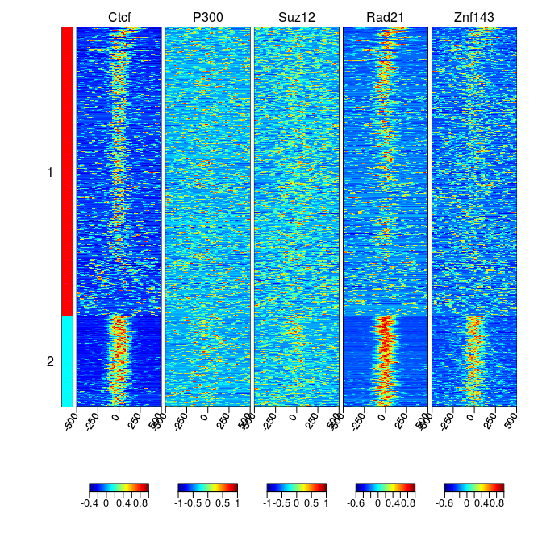
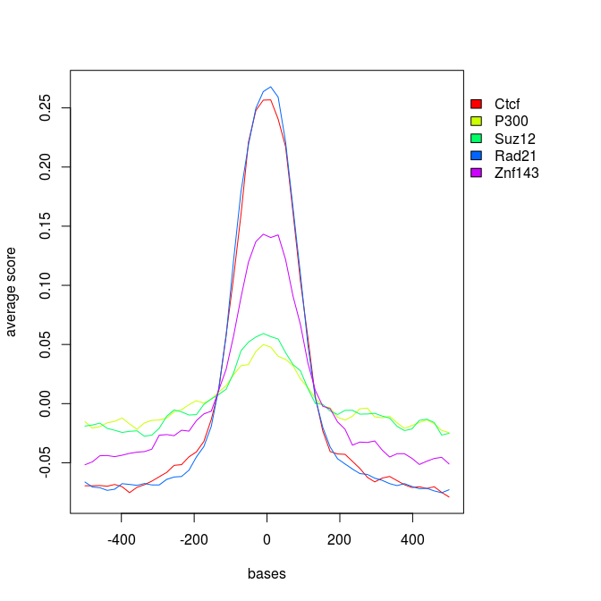
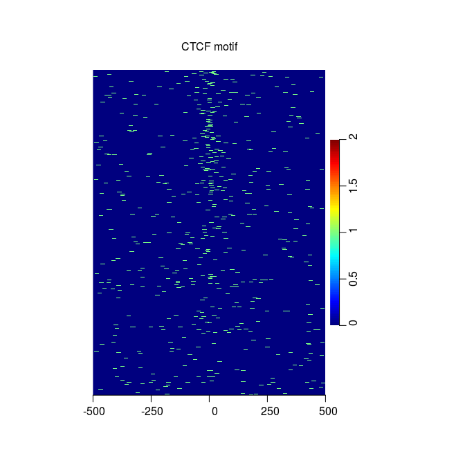

# Summary of new features of genomation
Katarzyna Wreczycka  
[Genomation](https://bioconductor.org/packages/devel/bioc/html/genomation.html) is an R package to summarize, annotate
and visualize genomic intervals. It contains a collection of tools for visualizing and analyzing genome-wide data sets,
i.e. RNA-seq, reduced representation bisulfite sequencing (RRBS) or chromatin-immunoprecipitation followed by sequencing 
(Chip-seq) data.

Recently we added new features to genomation and here we present them on example of 
binding profiles of 6 transcription factors around the Ctcf binding sites derived from Chip-seq.
All new functionalities are available in the latest version of genomation that can be found on 
[it's github website](https://github.com/BIMSBbioinfo/genomation).


```r
# install the package from github
library(devtools)
install_github("BIMSBbioinfo/genomation",build_vignettes=FALSE)
```

```
## Downloading GitHub repo BIMSBbioinfo/genomation@master
## Installing genomation
## '/Library/Frameworks/R.framework/Resources/bin/R' --no-site-file  \
##   --no-environ --no-save --no-restore CMD INSTALL  \
##   '/private/var/folders/yw/d8380s055ljgrwmx9817twlh000plr/T/RtmpwGy9Vw/devtools9aa434cbe5d/BIMSBbioinfo-genomation-40b6019'  \
##   --library='/Library/Frameworks/R.framework/Versions/3.2/Resources/library'  \
##   --install-tests 
## 
## Reloading installed genomation
```

```r
library(genomation)
```

# Extending genomation to work with paired-end BAM files

Genomation can work with paired-end BAM files. Mates from reads
are treated as fragments (they are stitched together).


```r
genomationDataPath = system.file('extdata',package='genomationData')
bam.files = list.files(genomationDataPath, full.names=TRUE, pattern='bam$')
bam.files = bam.files[!grepl('Cage', bam.files)]
```

# Accelerate functions responsible for reading genomic files
This is achived by using _readr::read_delim_ function to read genomic files
instead of _read.table_.
Additionally if skip="auto" argument is provided in _readGeneric_or track.line="auto" in other functions 
that read genomic files, e.g. _readBroadPeak_ then
UCSC header is detected (and first track).


```r
library(GenomicRanges)

ctcf.peaks = readBroadPeak(file.path(genomationDataPath, 
                                     'wgEncodeBroadHistoneH1hescCtcfStdPk.broadPeak.gz'))
ctcf.peaks = ctcf.peaks[seqnames(ctcf.peaks) == 'chr21']
ctcf.peaks = ctcf.peaks[order(-ctcf.peaks$signalValue)]
ctcf.peaks = resize(ctcf.peaks, width=1000, fix='center')
```

# Parallelizing data processing in ScoreMatrixList
We use _ScoreMatrixList_ function to extract coverage values of all transcription factors 
around ChIP-seq peaks. _ScoreMatrixList_ was improved by adding new argument _cores_
that indicates number of cores to be used at the same time (by using _parallel:mclapply_).


```r
sml = ScoreMatrixList(bam.files, ctcf.peaks, bin.num=50, type='bam', cores=2)

# descriptions of file that contain info. about transcription factors
sampleInfo = read.table(system.file('extdata/SamplesInfo.txt',
                                    package='genomationData'),header=TRUE, sep='\t')
names(sml) = sampleInfo$sampleName[match(names(sml),sampleInfo$fileName)]
```

# Arithmetic, indicator and logic operations as well as subsetting work on score matrices
Arithmetic, indicator and logic operations work on _ScoreMatrix_, _ScoreMatrixBin_ and _ScoreMatrixList_<br />
objects, e.i.:<br />
Arith: "+", "-", "*", "^", "%%", "%/%", "/" <br />
Compare: "==", ">", "<", "!=", "<=", ">=" <br />
Logic: "&", "|"   <br />


```r
sml1 = sml * 100
sml1
```

```
## scoreMatrixlist of length:5
## 
## 1. scoreMatrix with dims: 1681 50
## 2. scoreMatrix with dims: 1681 50
## 3. scoreMatrix with dims: 1681 50
## 4. scoreMatrix with dims: 1681 50
## 5. scoreMatrix with dims: 1681 50
```

Subsetting:


```r
sml[[6]] = sml[[1]]
sml 
```

```
## scoreMatrixlist of length:6
## 
## 1. scoreMatrix with dims: 1681 50
## 2. scoreMatrix with dims: 1681 50
## 3. scoreMatrix with dims: 1681 50
## 4. scoreMatrix with dims: 1681 50
## 5. scoreMatrix with dims: 1681 50
## 6. scoreMatrix with dims: 1681 50
```

```r
sml[[6]] <- NULL
```

# Improvements and new arguments in visualization functions
Due to large signal scale of rows of each element in the _ScoreMatrixList_ 
we scale them.


```r
sml.scaled = scaleScoreMatrixList(sml)
```

## Faster heatmaps

 _HeatMatrix_ and _multiHeatMatrix_ function works faster by faster assigning colors.
Heatmap profile of scaled coverage shows a colocalization of Ctcf, Rad21 and Znf143. 


```r
multiHeatMatrix(sml.scaled, xcoords=c(-500, 500))
```

 

## New clustering possibilities in heatmaps: "clustfun" argument in multiHeatMatrix
_clustfun_ allow to add more clustering functions and integrate them with the heatmap function
multiHeatMatrix. It has to be a function that returns a vector
of integers indicating the cluster to which each point is allocated.
Previous version of _multiHeatMatrix_ 
could cluster rows of heatmaps using only k-means algorithm.


```r
# k-means algorithm with 2 clusters
cl1 <- function(x) kmeans(x, centers=2)$cluster
multiHeatMatrix(sml.scaled, xcoords=c(-500, 500), clustfun = cl1)
```

 

```r
# hierarchical clustering with Ward's method for agglomeration into 2 clusters
cl2 <- function(x) cutree(hclust(dist(x), method="ward"), k=2)
multiHeatMatrix(sml.scaled, xcoords=c(-500, 500), clustfun = cl2)
```

```
## The "ward" method has been renamed to "ward.D"; note new "ward.D2"
```

 

## Defining which matrices are used for clustering: "clust.matrix" in multiHeatMatrix
clust.matrix argument indicates which matrices are used for clustering.
It can be a numerical vector of indexes of matrices or a character vector of
names of the ‘ScoreMatrix’ objects in 'ScoreMatrixList'. 
Matrices that are not in clust.matrix are ordered 
according to the result of the clustering algorithm.
By default all matrices are clustered.


```r
multiHeatMatrix(sml.scaled, xcoords=c(-500, 500), clustfun = cl1, clust.matrix = 1)
```

 

## Central tendencies in line plots: centralTend in plotMeta
We extended visualization capabilities for meta-plots.
_plotMeta_ function can plot not only mean, but also median as central tendency
and it can be set up using _centralTend_ argument.
Previously user could plot only mean.


```r
plotMeta(mat=sml.scaled, profile.names=names(sml.scaled),
         xcoords=c(-500, 500),
         winsorize=c(0,99),
         centralTend="mean")
```

 

## Smoothing central tendency: smoothfun in plotMeta
We added _smoothfun_ argument to smooth central tendency as well as dispersion bands around
it which is shown in the next figure. Smoothfun has to be a function that returns a 
list that contains a vector of y coordinates (vector named '$y').


```r
plotMeta(mat=sml.scaled, profile.names=names(sml.scaled),
         xcoords=c(-500, 500),
         winsorize=c(0,99),
         centralTend="mean",  
         smoothfun=function(x) stats::smooth.spline(x, spar=0.5))
```

 

## Plotting dispersion around central lines in line plots: dispersion in plotMeta	 
We added new argument _dispersion_ to plotMeta that shows dispersion bands around _centralTend_.
It can take one of the arguments:
         
* "se"  shows standard error of the mean and 95 percent
             confidence interval for the mean
* "sd"  shows standard deviation and 2*(standard deviation)
* "IQR" shows 1st and 3rd quartile and confidence interval
             around the median based on the median +/- 1.57 *
             IQR/sqrt(n) (notches)


```r
plotMeta(mat=sml, profile.names=names(sml),
         xcoords=c(-500, 500),
         winsorize=c(0,99),
         centralTend="mean",  
         smoothfun=function(x) stats::smooth.spline(x, spar=0.5),
         dispersion="se", lwd=4)
```

 

# Calculating scores that correspond to k-mer or PWM matrix occurence: patternMatrix function
We added new function _patternMatrix_ that calculates
k-mer and PWM occurrences over predefined equal width windows.
If one pattern (character of length 1 or PWM matrix) is given then it returns ScoreMatrix, 
if more than one character ot list of PWM matrices then ScoreMatrixList.
It finds either positions of pattern hits above a specified threshold and creates score matrix filled with
1 (presence of pattern) and 0 (its absence) or
matrix with score themselves. _windows_ can be a DNAStringList object or GRanges object 
(but then genome argument has to be provided, a BSgenome object). 


```r
#ctcf motif from the JASPAR database
ctcf.pfm = matrix(as.integer(c(87,167,281,56,8,744,40,107,851,5,333,54,12,56,104,372,82,117,402, 
                                291,145,49,800,903,13,528,433,11,0,3,12,0,8,733,13,482,322,181, 
                                76,414,449,21,0,65,334,48,32,903,566,504,890,775,5,507,307,73,266, 
                                459,187,134,36,2,91,11,324,18,3,9,341,8,71,67,17,37,396,59)), 
                  ncol=19,byrow=TRUE)
rownames(ctcf.pfm) <- c("A","C","G","T")

prior.params = c(A=0.25, C=0.25, G=0.25, T=0.25)
priorProbs = prior.params/sum(prior.params)
postProbs = t( t(ctcf.pfm + prior.params)/(colSums(ctcf.pfm)+sum(prior.params)) )
ctcf.pwm = unitScale(log2(postProbs/priorProbs))

library(BSgenome.Hsapiens.UCSC.hg19)
hg19 = BSgenome.Hsapiens.UCSC.hg19

p = patternMatrix(pattern=ctcf.pwm, windows=ctcf.peaks, genome=hg19, min.score=0.8)
```

Visualization of the patternMatrix
_patternMatrix_ (here as ScoreMatrix object) can be visualized using i.e. heatMatrix, heatMeta or plotMeta functions.


```r
heatMatrix(p, xcoords=c(-500, 500), main="CTCF motif")
```

 

```r
plotMeta(mat=p, xcoords=c(-500, 500), smoothfun=function(x) stats::lowess(x, f = 1/10), 
         line.col="red", main="ctcf motif")
```

 

# Integration with Travis CI for auto-testing
Recently we integrated genomation with [Travis CI](travis-ci.org). It allows users to see current status
of the package which is updated during every change of the package. Travis
automatically runs R CMD CHECK and reports it. Shields shown below are on the genomation github site:<br />
[https://github.com/BIMSBbioinfo/genomation](https://github.com/BIMSBbioinfo/genomation)
<br />
Status [](https://travis-ci.org/BIMSBbioinfo/genomation)   [](https://codecov.io/github/BIMSBbioinfo/genomation?branch=master)     [](http://www.bioconductor.org/packages/release/bioc/html/genomation.html)     [](http://www.bioconductor.org/packages/release/bioc/html/genomation.html)
<br />
<br />


```r
# <br />
sessionInfo()
```

```
## R version 3.2.2 (2015-08-14)
## Platform: x86_64-apple-darwin13.4.0 (64-bit)
## Running under: OS X 10.9.4 (Mavericks)
## 
## locale:
## [1] en_US.UTF-8/en_US.UTF-8/en_US.UTF-8/C/en_US.UTF-8/en_US.UTF-8
## 
## attached base packages:
##  [1] stats4    parallel  grid      stats     graphics  grDevices utils    
##  [8] datasets  methods   base     
## 
## other attached packages:
##  [1] genomation_1.1.27                 BSgenome.Hsapiens.UCSC.hg19_1.4.0
##  [3] BSgenome_1.36.3                   rtracklayer_1.28.10              
##  [5] markdown_0.7.7                    knitr_1.11                       
##  [7] Biostrings_2.36.4                 XVector_0.8.0                    
##  [9] matrixStats_0.14.2                plotrix_3.5-12                   
## [11] GenomicRanges_1.20.8              GenomeInfoDb_1.4.3               
## [13] IRanges_2.2.9                     S4Vectors_0.6.6                  
## [15] BiocGenerics_0.14.0               devtools_1.9.1                   
## 
## loaded via a namespace (and not attached):
##  [1] reshape2_1.4.1          seqPattern_1.0.1       
##  [3] colorspace_1.2-6        htmltools_0.2.6        
##  [5] yaml_2.1.13             chron_2.3-47           
##  [7] XML_3.98-1.3            BiocParallel_1.2.22    
##  [9] lambda.r_1.1.7          plyr_1.8.3             
## [11] stringr_1.0.0           zlibbioc_1.14.0        
## [13] munsell_0.4.2           gtable_0.1.2           
## [15] futile.logger_1.4.1     memoise_0.2.1          
## [17] evaluate_0.8            BiocInstaller_1.18.4   
## [19] curl_0.9.3              proto_0.3-10           
## [21] Rcpp_0.12.1             KernSmooth_2.23-15     
## [23] readr_0.1.1             scales_0.3.0           
## [25] Rsamtools_1.20.5        impute_1.42.0          
## [27] ggplot2_1.0.1           digest_0.6.8           
## [29] stringi_0.5-5           tools_3.2.2            
## [31] bitops_1.0-6            magrittr_1.5           
## [33] RCurl_1.95-4.7          futile.options_1.0.0   
## [35] MASS_7.3-43             gridBase_0.4-7         
## [37] data.table_1.9.6        rmarkdown_0.8          
## [39] httr_1.0.0              R6_2.1.1               
## [41] GenomicAlignments_1.4.2
```


---
title: "summary.R"
author: "kwreczy"
date: "Mon Oct 12 17:59:59 2015"
---
