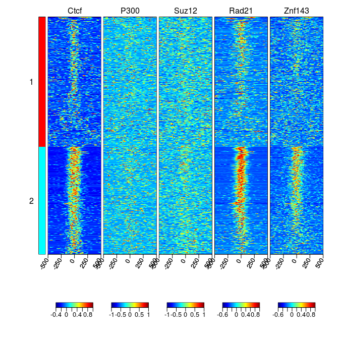
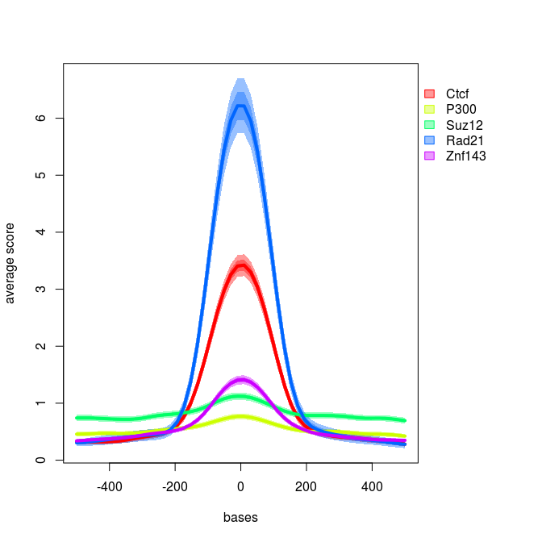

# Summarize new features of genomation
Katarzyna Wreczycka  
[Genomation](https://github.com/BIMSBbioinfo/genomation) is an R package to summarize, annotate
and visualize genomic intervals. It contains a collection of tools for visualizing and analyzing genome-wide data sets,
i.e. RNA-seq, reduced representation bisulfite sequencing (RRBS) or chromatin-immunoprecipitation followed by sequencing 
(Chip-seq) data.

We recently added new fetures to genomation and here are they presented on example of 
binding profiles of 6 transcription factors around the Ctcf binding sites.

All new functionality are available on the latest version of genomation available on github.


```r
# install the package from github
# library(devtools)
# install_github("BIMSBbioinfo/genomation",build_vignettes=FALSE)
# library(genomation)
library(devtools)
load_all("../genomation")
```

```
## Loading genomation
```

```r
library(GenomicRanges)
```

# Extending genomation to work with paired-end BAM files

Genomation can work with paired-end BAM files. Mates from a pair
are treated as fragments (are stitched together).


```r
genomationDataPath = system.file('extdata',package='genomationData')
bam.files = list.files(genomationDataPath, full.names=TRUE, pattern='bam$')
bam.files = bam.files[!grepl('Cage', bam.files)]
```

# Accelerate of function responsible for reading files
This is achived by using readr::read_delim function to read genomic files
instead of read.table.
Additionally if skip="auto" in readGeneric or track.line="auto" other functions
like readBroadPeak
then they detect UCSC header (and first track). #TODO


```r
ctcf.peaks = readBroadPeak(file.path(genomationDataPath, 
                                     'wgEncodeBroadHistoneH1hescCtcfStdPk.broadPeak.gz'))

ctcf.peaks = ctcf.peaks[seqnames(ctcf.peaks) == 'chr21']
ctcf.peaks = ctcf.peaks[order(-ctcf.peaks$signalValue)]
ctcf.peaks = resize(ctcf.peaks, width=1000, fix='center')
```

# Parallelizing data processing
We use ScoreMatrixList function to extract coverage values of all transcription factors 
around chipseq peaks. ScoreMatrixList was improved by adding new argument cores
that indicated number of cores to be used at the same time by using parallel:mclapply.


```r
sml = ScoreMatrixList(bam.files, ctcf.peaks, bin.num=50, type='bam', cores=2)

# Names of .. we stored in the SamplesInfo.txt file.
sampleInfo = read.table(system.file('extdata/SamplesInfo.txt',
                                    package='genomationData'),header=TRUE, sep='\t')
names(sml) = sampleInfo$sampleName[match(names(sml),sampleInfo$fileName)]
```

# Arithmetic, indicator and logic operations as well as subsetting work on score matrices
Arithmetic, indicator and logic operations work on ScoreMatrix, ScoreMatrixBin and ScoreMatrixList<br />
objects, e.i.:<br />
Arith: "+", "-", "*", "^", "%%", "%/%", "/" <br />
Compare: "==", ">", "<", "!=", "<=", ">=" <br />
Logic: "&", "|"   <br />


```r
sml1 = sml * 100
sml1
```

```
## scoreMatrixlist of length:5
## 
## 1. scoreMatrix with dims: 1681 50
## 2. scoreMatrix with dims: 1681 50
## 3. scoreMatrix with dims: 1681 50
## 4. scoreMatrix with dims: 1681 50
## 5. scoreMatrix with dims: 1681 50
```

Subsetting:


```r
sml[[6]] = sml[[1]]
sml 
```

```
## scoreMatrixlist of length:6
## 
## 1. scoreMatrix with dims: 1681 50
## 2. scoreMatrix with dims: 1681 50
## 3. scoreMatrix with dims: 1681 50
## 4. scoreMatrix with dims: 1681 50
## 5. scoreMatrix with dims: 1681 50
## 6. scoreMatrix with dims: 1681 50
```

```r
sml[[6]] <- NULL
```

# New arguments in visualizing functions
Because of large signal scale the rows of each element in the ScoreMatrixList.


```r
sml.scaled = scaleScoreMatrixList(sml)
```

Heatmap profile of scaled coverage shows a colocalization of Ctcf, Rad21 and Znf143. 


```r
multiHeatMatrix(sml.scaled, xcoords=c(-500, 500))
```

 

## clustfun in multiHeatMatrix
clustfun allow to add more clustering functions and integrate them with heatmap function
multiHeatMatrix. clustfun argument should be a function that returns a vector
of integers indicating the cluster to which each point is allocated.
It's an extention of previous version that could cluster rows of heatmaps using k-means algorithm.


```r
# k-means algorithm, 2 clusters
cl1 <- function(x) kmeans(x, centers=2)$cluster
multiHeatMatrix(sml.scaled, xcoords=c(-500, 500), clustfun = cl1)
```

 

```r
# hierarchical clustering with Ward's method for agglomeration, 2 clusters
cl2 <- function(x) cutree(hclust(dist(x), method="ward"), k=2)
multiHeatMatrix(sml.scaled, xcoords=c(-500, 500), clustfun = cl2)
```

```
## The "ward" method has been renamed to "ward.D"; note new "ward.D2"
```

 

## clust.matrix in multiHeatMatrix
clust.matrix argument indicates which matrices are used for clustering.
It can be a numerical vector of indexes of matrices or a character vector of
names of the ‘ScoreMatrix’ objects in 'sml'. By default all matrices are clustered.


```r
multiHeatMatrix(sml.scaled, xcoords=c(-500, 500), clustfun = cl1, clust.matrix = 1)
```

 

## centralTend in plotMeta
extending visualization capabilities for meta-plots - improving the plotMeta func-
tion to plot not only mean, but also median as a central tendency, adding possibil-
ity to plot dispersion bands around the central tendency and to smoothing central
tendency and dispersion bands,


```r
plotMeta(mat=sml.scaled, profile.names=names(sml.scaled),
	 xcoords=c(-500, 500),
	 winsorize=c(0,99),
	 centralTend="mean")
```

 

## smoothfun in plotMeta


```r
plotMeta(mat=sml.scaled, profile.names=names(sml.scaled),
	 xcoords=c(-500, 500),
	 winsorize=c(0,99),
	 centralTend="mean",  
	 smoothfun=function(x) stats::smooth.spline(x, spar=0.5))
```

 

## dispersion in plotMeta	 


```r
plotMeta(mat=sml.scaled, profile.names=names(sml.scaled),
	 xcoords=c(-500, 500),
	 winsorize=c(0,99),
	 centralTend="mean",  
	 smoothfun=function(x) stats::smooth.spline(x, spar=0.5),
	 dispersion="se", lwd=4)
```

 

# Integration with Travis CI for auto-testing
Recently we integrated genomation with [Travis CI](travis-ci.org) which allows users to see current status
of the package which is updated during every change of the package. Travis
automatically runs R CMD CHECK and reports it. Such shields are visible on the genomation github site:<br />
[https://github.com/BIMSBbioinfo/genomation](https://github.com/BIMSBbioinfo/genomation)
<br />
Status [](https://travis-ci.org/BIMSBbioinfo/genomation)   [](https://codecov.io/github/BIMSBbioinfo/genomation?branch=master)     [](http://www.bioconductor.org/packages/release/bioc/html/genomation.html)     [](http://www.bioconductor.org/packages/release/bioc/html/genomation.html)
<br />
<br />


```r
# <br />
sessionInfo()
```

```
## R version 3.1.3 (2015-03-09)
## Platform: x86_64-pc-linux-gnu (64-bit)
## Running under: Ubuntu 14.04.2 LTS
## 
## locale:
##  [1] LC_CTYPE=pl_PL.UTF-8       LC_NUMERIC=C              
##  [3] LC_TIME=pl_PL.UTF-8        LC_COLLATE=pl_PL.UTF-8    
##  [5] LC_MONETARY=pl_PL.UTF-8    LC_MESSAGES=pl_PL.UTF-8   
##  [7] LC_PAPER=pl_PL.UTF-8       LC_NAME=C                 
##  [9] LC_ADDRESS=C               LC_TELEPHONE=C            
## [11] LC_MEASUREMENT=pl_PL.UTF-8 LC_IDENTIFICATION=C       
## 
## attached base packages:
##  [1] stats4    parallel  grid      stats     graphics  grDevices utils    
##  [8] datasets  methods   base     
## 
## other attached packages:
## [1] genomation_1.1.22    readr_0.1.1          GenomicRanges_1.18.4
## [4] GenomeInfoDb_1.2.5   IRanges_2.0.1        S4Vectors_0.4.0     
## [7] BiocGenerics_0.12.1  devtools_1.8.0       rmarkdown_0.6.1     
## 
## loaded via a namespace (and not attached):
##  [1] base64enc_0.1-3         BatchJobs_1.6          
##  [3] BBmisc_1.9              BiocParallel_1.0.3     
##  [5] Biostrings_2.34.1       bitops_1.0-6           
##  [7] brew_1.0-6              checkmate_1.6.2        
##  [9] chron_2.3-47            codetools_0.2-11       
## [11] colorspace_1.2-6        data.table_1.9.6       
## [13] DBI_0.3.1               digest_0.6.8           
## [15] evaluate_0.8            fail_1.2               
## [17] foreach_1.4.2           GenomicAlignments_1.2.2
## [19] ggplot2_1.0.1           git2r_0.11.0           
## [21] gridBase_0.4-7          gtable_0.1.2           
## [23] htmltools_0.2.6         impute_1.40.0          
## [25] iterators_1.0.7         knitr_1.11             
## [27] magrittr_1.5            MASS_7.3-44            
## [29] matrixStats_0.14.2      memoise_0.2.1          
## [31] munsell_0.4.2           plotrix_3.5-12         
## [33] plyr_1.8.3              proto_0.3-10           
## [35] Rcpp_0.12.1             RCurl_1.95-4.7         
## [37] reshape2_1.4.1          roxygen2_4.1.1         
## [39] Rsamtools_1.18.3        RSQLite_1.0.0          
## [41] rstudioapi_0.3.1        rtracklayer_1.26.3     
## [43] rversions_1.0.0         scales_0.3.0           
## [45] sendmailR_1.2-1         stringi_0.5-5          
## [47] stringr_1.0.0           tcltk_3.1.3            
## [49] tools_3.1.3             XML_3.98-1.1           
## [51] XVector_0.6.0           yaml_2.1.13            
## [53] zlibbioc_1.12.0
```


---
title: "summary.R"
author: "kasia"
date: "Thu Sep 24 02:25:03 2015"
---
